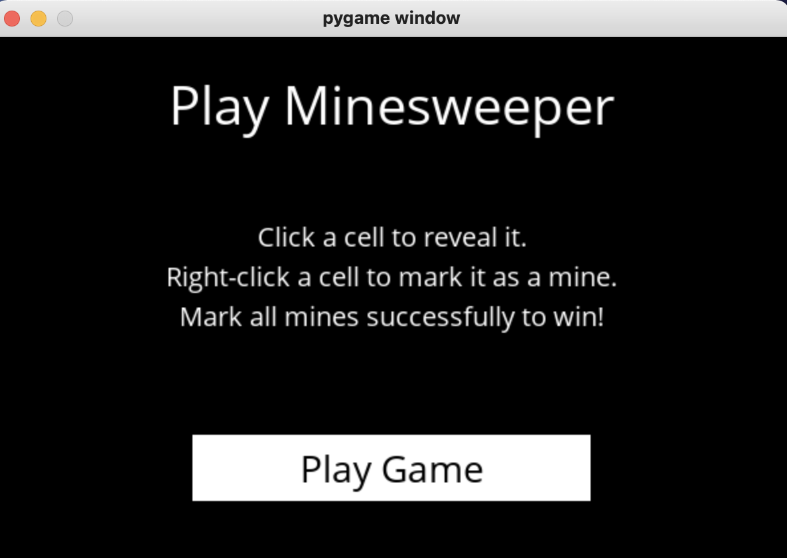
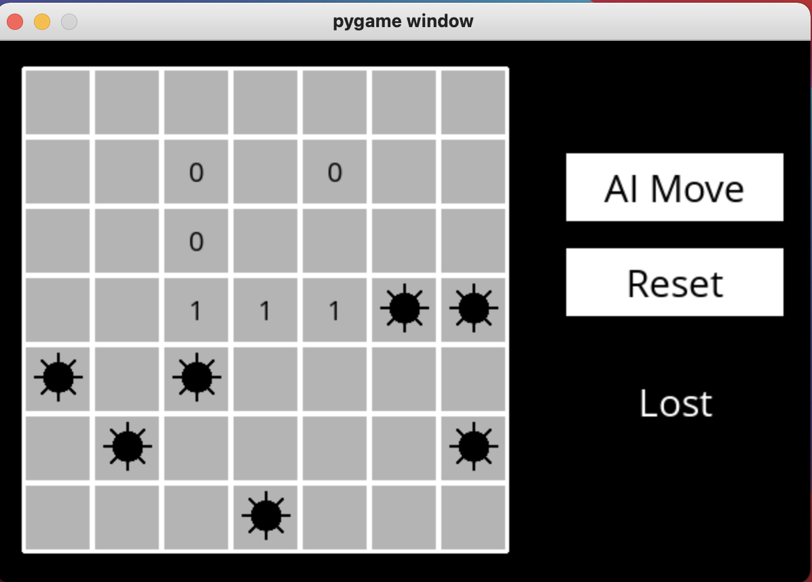
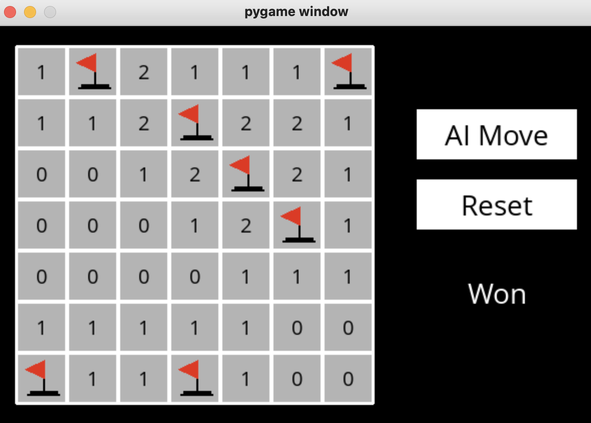

# Minesweeper
an AI that uses inference to calculate the safe moves and solve the board in minesweeper. The project is based on Harvard online course CS50: Intro to Artificial Intelligence. 

Given the state of the board and moves made, the AI learns new found information and updates its knowlege base accordingly. After certain number of moves, the AI can predict which moves are safe and which ones contain mines in the entire board. 

### Requirements:
1. python
2. pyGame 
  

### To play the game, 
1. Download all the files into your local directory
2. cd to the same directory from the command line
3. type "python runner.py" and press Enter
4. Enjoy

Game Instructions: Left-click to mark the square safe, Right-click to mark mine. Game will be over if all mines are found or if you click on mines. Click on "AI Move" if you need hints. Click on "Reset" to start a new game. 

Note: You can also modify the game by going to runner.py and changing the height, width and mines. 

----

Some screenshots from the game

